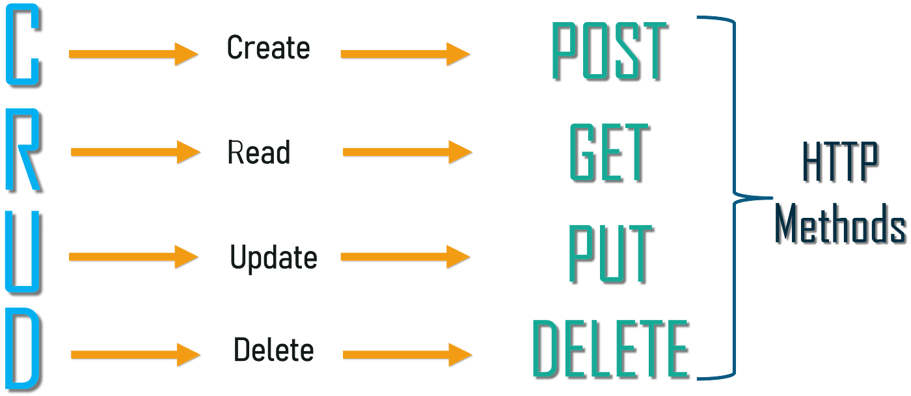
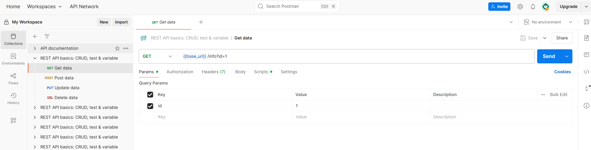
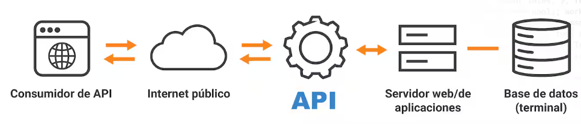
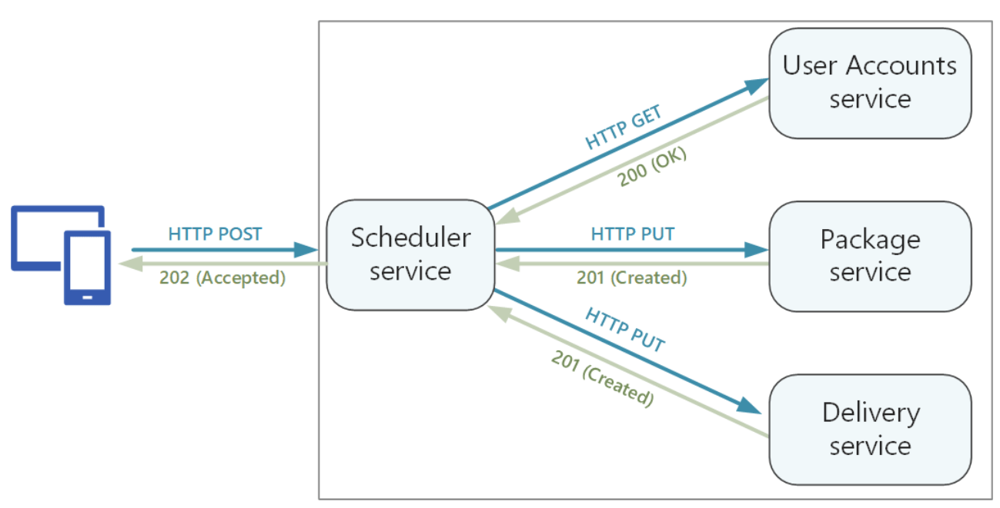
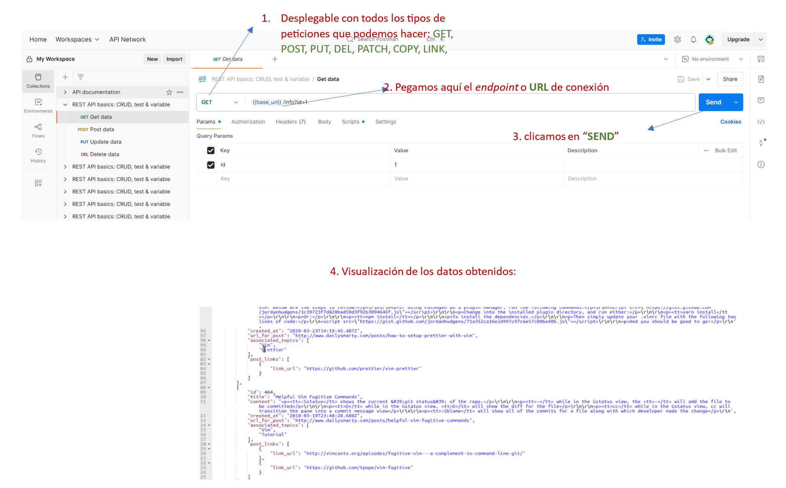

## 1.	¿Para qué usamos Clases en Python?
### Qué es una clase
Una clase es como una plantilla que define las características (**atributos**) y los comportamientos (**métodos**) que tendrán los objetos que se creen a partir de ella. 
Las clases son como ***"mapeadores de objetos"***, que te permiten construir una estructura o esquema para los objetos. Por lo tanto, contienen **datos, funciones, y también comportamiento**.

### Utilidad de las clases
Las clases ayudan a estructurar el código de una forma limpia y ordenada, permitiendo la  **reutilización** de su código sin el arduo trabajo de tener que codificar de nuevo. 

##### Ejemplo:
    class Almacen:
       proposito = 'almacenaje'
       zona = 'oeste'
    
    a1 = Almacen()                #esta es una instancia concreta
    
    print(a1.proposito, a1.zona)    # devuelve:  almacenaje oeste

### Qué es una instancia
Una instancia es una **realización concreta de esa clase** o plantilla, un objeto real con valores específicos para sus atributos.  Al crear una nueva clase, se crea un **nuevo** tipo de **objeto**, permitiendo crear **nuevas instancias** de ese tipo. 

Cada **instancia de clase** puede tener **atributos adjuntos** para mantener su estado. Las instancias de clase también pueden tener **métodos** (definidos por su clase) para modificar su estado.

En este punto, definamos dos tipos de atributo.

#### Dos tipos de atributos:

- **Atributos de instancia**: Pertenecen a la **instancia de la clase o al objeto**. Son atributos particulares de cada instancia.
- **Atributos de clase**: Se trata de atributos que pertenecen **a la clase**, por lo tanto serán **comunes** para todos los objetos.

#### Sintaxis:

La sintaxis básica para definir una clase en Python es:  <strong> **class NombreDeLaClase:** </strong> seguida de un bloque de código con las definiciones de sus atributos y métodos. 

 

-------------------------------------------------------------------------------------
## 2.	¿Qué método se ejecuta automáticamente cuando se crea una instancia de una clase?

El método que se ejecuta **automáticamente** por el intérprete de Python (sin ser llamado) cuando se crea una instancia de una clase es el método **constructor** (también llamado **inicializador** o método <strong> \_\_init__ </strong> en Python). Este método, más que 'construir' en realidad se encarga de **inicializar los atributos de la clase** y realizar cualquier acción necesaria para preparar el objeto para su uso.  El método <strong> \_\_init__ </strong>. Es uno de los métodos con la denominación en inglés de <strong>Dunder</strong> de Python (y que explicaremos con detalle en **el punto nº 8** de estos ejercicios), llamados así porque comienzan y finalizan con dos guiones bajos seguidos (<strong> \__ </strong> )

### Ejemplo:

    class MyClass:    
        # Método constructor creado a crear el objeto:
        def __init__(self, atributo1, atributo2):
            self.atributo1 = atributo1
            self.atributo2 = atributo2
    
        # Método definido dentro de la clase:
        def mi_metodo(self):
        return f"Atributo nº 1: {self.attributo1}, Atributo nº 2: {self.atributo2}"

​         
​        

El argumento <strong>(self)</strong> se utiliza al declarar una función como método para **dar un nombre a esta variable de instancia dentro del ámbito de la función**; se trata de una referencia a la instancia actual del objeto que se está creando. El nombre <strong>self</strong> es una **convención estándar** para que otros codificadores (o uno mismo) sea consciente de la intención de referirse a la instancia que llama al método. El argumento <strong>(self)</strong> permite:
- **acceder a los atributos de la instancia** (en nuestro caso <strong>self.atributo1</strong> y <strong>self.atributo2</strong>).
- **llamar a los métodos de dicha instancia**. Los métodos de instancia son métodos que actúan sobre las instancias de una clase. Tienen acceso a los atributos de esas instancias a través del parámetro <strong>(self)</strong> . Por ejemplo <strong>self.mostrar_nombre()</strong> llama al método <strong>mostrar_nombre</strong> de la instancia.
- **referenciar la instancia misma**, ya que <strong>self</strong> representa al objeto de la clase.

##### Veamos otro ejemplos:
        class Gato:
        # El método __init__ es llamado al crear el objeto:
        
            def __init__(self, nombre, raza):
                print(f"Creando gato {nombre}, {raza}")
        
                # Atributos de instancia:
                self.nombre = nombre
                self.raza = raza
                
            #creando otro método de la clase:  
            def maullar(self)                 
                print(f" {self.nombre} maulla: Miauuuu")
            
       #creando objeto pasando el valor de los atributos (creando instancia de la clase Gato):
       mi_gato = Gato("Sammy", "tuxido")   #devuelve: Creando gato Sammy, tuxido
       
       #llamando al método maullar
       mi_gato.maullar()                   #devuelve:    Sammy maulla: Miauuuu

​       
​       
​       
Notas:
- El argumento <strong>(self)</strong>:  cuando se llama a un método dentro de una instancia, no se necesita pasar <strong>(self)</strong> explícitamente como argumento
- En el método <strong>maullar(self)</strong>, <strong><i>(self)</strong></i> permite acceder a los **atributos** <strong>"nombre"</strong> y <strong>"raza"</strong> de la instancia actual, e imprime *"Sammy maulla: Miauuuu"*.
- Al llamar a <strong>mi_gato.maullar()</strong>, estamos utilizando una **instancia** llamada <strong>mi_gato</strong> como el valor de <strong>(self)</strong> dentro del método. 
   
  

 

-------------------------------------------------------------------------------------

​        
​        

## 3.		¿Cuáles son los tres verbos de API?
 

En ***API Flask*** (y en general en el protocolo **HTTP**), los nombres de los tres verbos **más comunes** -y que definen cómo se interactúa con los recursos de una **API**- son los siguientes (junto con sus correspondientes operaciones):

| GET     | POST     | PUT           |
|:---------:|:----------:|:---------------:|
|Lectura | Creación | Actualización |

(y para eliminar un recurso, utilizaremos **DELETE**):

 
 

 
  
 
<h3> Detalle de las funciones:</h3>

- <strong>GET</strong>:
  Este verbo se utiliza para **recuperar información** de un recurso específico. Utilizaremos este método para cualquier llamada de **API** externa dentro de ***Flask***. Ejemplos:
    * Se puede usar para obtener los datos de un usuario con un ID determinado
    * Para obtener una lista de todos los productos en una tienda online. 

- <strong>POST</strong>: este verbo se utiliza para **crear un nuevo recurso**. Ejemplos:
    - Se puede usar para registrar un nuevo usuario en una aplicación
    - Para crear una nueva orden de compra en una tienda online.
    
- <strong>PUT</strong>:
  Este verbo se utiliza para **actualizar completamente** un recurso existente. En otras palabras, se envía **una nueva versión completa** del recurso, reemplazando la versión anterior. Ejemplo:
    * Se puede usar para actualizar los datos de un usuario, reemplazando todos los campos de su información.
  
     

##### Ejemplo:
| Acción                                   | URL (endpoint)      | Verbo HTTP |
|:------------------------------------------|:---------------------:|:------------:|
| Obtener publicaciones                    | /publicaciones      | get        |
| Obtener una publicación en específico    | /publicaciones/: id | get        |
| Registrar publicación                    | /publicaciones      | post       |
| Actualizar una publicación               | /publicación/:id    | put        |
| Actualizar una publicación en específico | /publicación/ :id   | put        |

Y aquí los tenemos en ***Postman*** (explicaremos mejor ***Postman*** en el **punto 6** de estos ejercicios) elegiríamos dentro de las opciones de la izquierda (<strong>GET/POST/PUT/DELETE</strong>) y añadiríamos en *endpoint* en cuestión. Un ***endpoint API*** es la "puerta de entrada", un punto de conexión a una parte específica de la **API**. Se refiere a **la dirección URL específica** de una recurso en una API (*Interfaz de Programación de Aplicaciones*). Es el punto de acceso a través del cual una aplicación o servicio interactúa con la **API** para acceder a datos o funciones:
 
 

 
 
 

-------------------------------------------------------------------------------------

​        
​        

## 4.	¿Es MongoDB una base de datos SQL o NoSQL?

- <strong>MongoDB</strong> es una base de datos <strong>NoSQL</strong> que utiliza un modelo flexible y orientado a documentos. Se basa en el teorema **CAP**, priorizando la ***disponibilidad y tolerancia*** a la partición. Almacena datos en documentos <strong>JSON</strong> (JavaScript Object Notation) o <strong>BSON</strong> (Binary JSON) dentro de colecciones, lo que ofrece **flexibilidad para modificar** el esquema de los datos. 

- Una base de datos <strong>SQL</strong> es **relacional** y organiza los datos en tablas con **esquemas predefinidos**. Es decir, almacena datos en tablas estructuradas con filas y columnas, donde cada tabla tiene una relación definida con otras tablas. Las propiedades **ACID** son cruciales para garantizar que las transacciones en bases de datos sean **correctas, fiables y que los datos se mantengan íntegros**. Son esenciales para sistemas que manejan datos sensibles, como transacciones bancarias o sistemas de gestión de información crítica.  

 

 

En cuanto a CUÁL ELEGIR, dependerá absolutamente de los **objetivos** de nuestro proyecto: 
- **Para transacciones complejas** (como por ejemplo ***joins*** entre tablas) y con una necesidad alta de integridad de datos deberíamos usar <strong>SQL</strong>.
- Sin embargo, para **datos no estructurados** o docs que puedan variar en estructura, documentos de gran tamaño, aplicaciones web/móvil para almacenar datos dinámicos, elegiríamos   un sistema <strong>NoSQL</strong> como <strong>MongoDB</strong>.
 

 

-------------------------------------------------------------------------------------

​        
​        

## 5.	¿Qué es una API??
 
 

 
 

Una <strong>interfaz de programación de aplicaciones</strong>, o <strong>API</strong>, es un conjunto de protocolos y definiciones que permiten que **diferentes programas y componentes de software se comuniquen entre sí**, y compartan datos y funcionalidad; es decir, sirven para establecer **un punto de conexión o interacción entre dos sistemas software**. Sin ellas, por ejemplo, no sería posible la conexión entre redes sociales, plataformas online, sistemas operativos o bases de datos. 

Dicho de forma sencilla, las <strong>API</strong> es una forma que podemos comunicarnos con una aplicación, sin necesidad de implementar aplicaciones tipo ***web scraper*** ("raspado Web", extraer datos de una web de forma automática). Nos da una serie de comandos para comunicarnos con otro servidor u otra aplicación. Te da una serie de **endpoints** o **URL**s. Típicamente las <strong>API</strong> retornan datos **JSON** (aunque también pueden manejar XML, HTML, texto...). En definitiva retornan algo que realmente pueden utilizar aplicaciones externas (**React, View, Angular...**). Si tratáramos de analizar los datos que necesitamos de la URL de una API, sería bastante caótico. Por esto existen aplicaciones como <strong>Postman</strong>  que veremos en el siguiente punto.

Las <strong>API</strong> se utilizan para **desarrollar e integrar el software de las aplicaciones**. A diferencia de **una interfaz de usuario** (**UX**), que conecta a una persona con un ordenador, una <strong>API</strong> conecta a **dos softwares** o partes de un software. Cuando un usuario utiliza una aplicación o web, no tendrá acceso a la <strong>API</strong> , aunque disfrute de sus ventajas.

Las <strong>API</strong> son esenciales para:
- los **servicios en la nube** *(p.ej. Amazon S3)*
- los **microservicios** *(p.ej. una plataforma de comercio electrónico)*
- las **arquitecturas sin servidor** (por su escalabilidad, flexibilidad y fácil mantenimiento) 
- el **Internet de las cosas (IoT)** *(p.ej. hogar inteligente -termostatos,luces, cerradoras, sensores médicos, vehículos autónomos)* de los que dependen muchos entornos de TI.

<figure>
  
  <figcaption><strong>
Estructura de una API para MICROSERVICIOS</figcaption></strong>

</figure>
 

Las <strong>API</strong> también rigen cómo se **permite que interactúen las aplicaciones**, y controlan **cómo** se realizan las **solicitudes** y los **tipos de solicitudes** que se pueden intercambiar entre programas.

##### Importancia de la Seguridad:
* Los puntos de conexión de las <strong>API</strong> hacen que el sistema sea **vulnerable a los ataques**. La supervisión de las <strong>API</strong> es crucial para evitar su uso indebido.

* Dado que exponen la **lógica y los recursos** de las aplicaciones, y a menudo implican la transferencia de **información confidencial**, las <strong>API</strong> son un objetivo atractivo para los **hackers**. Una **<strong>API</strong> no protegida** puede hacer posible que agentes maliciosos accedan a activos de TI que, de otro modo, serían seguros.

* La **protección** de las <strong>API</strong> implica un conjunto de **procesos, prácticas y tecnologías** que defienden las interfaces de programación de aplicaciones (<strong>API</strong>) de los ataques y el uso indebido por parte de agentes maliciosos. La protección de las <strong>API</strong> es una parte esencial de un programa de **ciberseguridad, interfaces de programación de aplicaciones**, así como una prioridad máxima para los equipos de seguridad.

* Por lo tanto, **la protección de las <strong>API</strong> es fundamental** para mantener la seguridad de las redes y las aplicaciones, así como para evitar la exposición de los datos y otros problemas de seguridad.

 
 

-------------------------------------------------------------------------------------

​        
​        
## 6.	¿Qué es Postman???
 
  <strong>Postman</strong> es una herramienta o aplicación gratuita que permite a los desarrolladores <strong>interactuar con <strong>APIs</strong> externas, enviar peticiones y ver las respuestas de forma sencilla y eficiente</strong>. No es específica de ningún lenguaje de programación o plataforma: tanto si construimos <strong>APIs</strong> a través de aplicaciones como <strong><i>React, Flask, Rails,</strong></i> etc. podemos utilizar <strong>Postman</strong> igualmente, ya que lo que <strong>Postman</strong> maneja son <strong>peticiones de datos</strong>. Por lo tanto es muy útil para construir <strong>APIs</strong>. 

   
  <strong>Postman</strong> es una plataforma integral para el <strong>desarrollo y prueba</strong> de <strong>APIs</strong>, que facilita cada etapa del ciclo de vida de las <strong>API</strong>, desde el <strong>diseño</strong> y las <strong>pruebas</strong> hasta la <strong>entrega y la monitorización</strong>. 

  

  <strong>Postman</strong> ofrece una interfaz gráfica de usuario intuitiva y fácil de usar, que permite a los desarrolladores interactuar con las <strong>API</strong> sin necesidad de una programación compleja. 

  Como comentábamos en el punto anterior, los datos que se obtienen directamente de la <strong>API</strong> (verbo: <strong>GET</strong>) pueden ser complejos de analizar:
   
   

   
   

  Sin embargo, podemos optimizar la comunicación con la <strong>API</strong> y así poder obtener estos datos y traerlos a la pantalla de una forma que sea **más fácil de entender y manejar**:

  Lo que haremos es poner la <strong>URL</strong> de la imagen anterior en la aplicación de <strong>Postman</strong>. Después de elegir el botón <strong><i>Request</strong></i>, añadimos una descripción a esta petición, y entraríamos a la siguiente pantalla, que es donde nos comunicaremos con nuestra <strong>API</strong>:

   
   
   

 
  Como vemos en los datos que hemos obtenido a través de la herramienta de <strong>Postman</strong>, ahora los datos tienen otro aspecto: visualmente más analizables. A través de verbos <strong><i>HTTP</strong></i>, como <strong>GET, POST, PUT, DELETE.</strong>, etc. esto ayuda a los desarrolladores a interactuar con las <strong>APIs</strong> y obtener resultados de este tipo.

**Pruebas de API**:  Se utiliza para pruebas manuales, automatizadas y de carga, permitiendo validar la funcionalidad de las <strong>API</strong>, identificar errores y asegurar su correcto funcionamiento. 

**Herramienta versátil**: <strong>Postman</strong> se integra con otras herramientas populares del desarrollo de software, como sistemas de control de versiones (<strong>GitHub</strong>), servicios de generación de documentación (<strong>Swagger</strong>) y herramientas de automatización de pruebas. 

Con <strong>Postman</strong> se puede modificar cosas sobre la marcha: **podemos poner las URLs que deseemos modificar y ¡listo!**: mucho más sencillo que hacerlo en la URL misma o en la terminal. Pero también si construyes una API para alguien (por ejemplo utilizando **Flask API**), puedes hacer **pruebas** con ella **en tu servidor** (ya que se está ejecutando en tu **máquina local**) sin necesidad de implementarla cada vez que haces pruebas. En realidad **te puedes comunicar con cualquier** ***endpoint*** con el que estés trabajando en tu máquina local.

 
 

-------------------------------------------------------------------------------------

​        
​        
## 7.	¿Qué es el polimorfismo?
 

Los  términos de **herencia** y **polimorfismo** tiene sentido explicarlos de forma conjunta, ya que están conectados. Expliquemos primero el término de **herencia**.

 

### 7.1.	Herencia
 

La ****herencia** ** es un proceso mediante el cual se puede crear una <strong><i>clase hija</strong></i> que hereda de una <strong><i>clase madre</strong></i>, compartiendo sus **métodos y atributos**. Una <strong><i>clase hija</strong></i> **puede sobreescribir los métodos o atributos, o incluso definir unos nuevos**.

Se puede crear una <strong><i>clase hija</strong></i> con tan solo pasar como parámetro la clase de la que queremos heredar (<strong><i>clase madre</strong></i>). En el siguiente ejemplo, la clase hija <strong><i>Perro</strong></i> hereda de la clase madre <strong><i>Animal</strong></i> al incluirla, como decimos, en el parámetro de <strong><i>Perro</strong></i>.

    class Animal:
      """Clase base para mostrar la herencia"""
    
      def __init__(self, nombre, patas):
        self.nombre = nombre
        self.patas = patas
    
      def saluda(self):
        print("El animal llamado " + str(self.nombre) + " saluda")
    
    class Perro(Animal):
      """Clase hija para mostrar la herencia"""
    
      def __init__(self, nombre):
        Animal.__init__(self, nombre, 4)
        self.sonido = "Guau"
    
      def ladra(self):
        print(self.sonido)
        
      def get_patas(self):
        return self.patas

​    
​    mi_mascota = Perro("Chucho")
​    mi_mascota.saluda()
​    mi_mascota.ladra()

La instancia de la clase <strong><i>Perro</strong></i> :

    mi_mascota = Perro("Chucho")

coge los atributos de <strong><i>nombre</strong>, <strong></i><i>patas</strong></i> y el método <i><strong></i><i>saluda</strong></i> que tiene <strong><i>Animal</strong></i>. Es como si internamente se copiara y pegara.

Si añadiéramos:

    print(f"Mi mascota tiene {mi_mascota.get_patas()} patas.")

estaríamos llamando al método <strong><i>get_patas</strong></i>, que devolvería el valor de <strong><i>patas</strong></i> y lo mostraría en pantalla.

 

### 7.2.	Poliformismo
 

En Python, el **polimorfismo** es la capacidad de diferentes objetos de **responder de manera distinta a un mismo mensaje o método**. Esto significa que se puede **llamar al mismo método en diferentes clases** y que cada una de ellas ejecutará la lógica que le corresponda. 
 

 ### 7.2.1. Poliformismo CON herencia

#### Ejemplo:

(En Python, la instrucción  <strong><i>pass</strong></i> es una instrucción **nula** que no hace nada cuando se ejecuta. Se utiliza como un marcador de posición, especialmente cuando se requiere una sentencia sintácticamente pero no se necesita código real.)

    class Animal:
        def __init__(self, nombre):
            self.nombre = nombre
    
        def hacer_sonido(self):
            pass
    
    class Perro(Animal):
        def hacer_sonido(self):
            return "guau"
    
    class Gato(Animal):
        def hacer_sonido(self):
            return "miau"
    
    class Vaca(Animal):
        def hacer_sonido(self):
            return "mu"

   Como vemos, tanto las clases (hijas) <strong><i>Perro</strong></i>, <strong><i>Gato</strong></i> y <strong><i>Vaca</strong></i> llaman a la clase madre <strong><i>Animal</strong></i> y ejecutan sus particulares instrucciones dentro de cada una de ellas. Precisamente éste es el **polimorfismo** , cuya etimología (griega) se desglosaría en la palabra española "muchas" (***poli***) y la palabra "formas" (***morphe***), como resultado de llamar a la <strong><i>misma clase madre</strong></i>. Lo que hemos hecho es **sobreescribir** el comportamiento de la <strong><i>clase madre</strong></i> con los diferentes sonidos "***guau", "miau", "mu"*** de las respectivas <strong><i>clases hijas</strong></i>.
    
    
      A veces no quieres que alguien llame a una <strong><i>clase en concreto</strong></i> (y esto es una convención común cuando utilizamos sistemas complejos o aplicaciones grandes). Por ejemplo, muchas veces no quieres que el usuario final se conecte <strong><i>con esa clase</strong></i>. Por ello, creamos una clase **abstracta** con el único propósito de *almacenar el comportamiento compartido*, y solo las clases **<strong><i>heredadas</strong></i>** (las clases hijas) van a ser las que llamen <strong><i>a esta clase</strong></i>. La forma de asegurarnos de que nadie llame <strong><i>a esta clase</strong></i> (ya que solo quiero que <strong><i>esa clase</strong></i> se pueda **heredar**) es declarando la función <strong><i>render()</i></strong> y la línea de comando <strong><i>raise</strong> <strong>NotImplementedError</strong></i>. Esto protege a las clases que necesitemos proteger. Cada nueva clase que creemos, debe acceder primero a la función <strong><i>render()</i></strong> (y que contiene este " <strong>NotImplementedError</strong></i>"), y si no lo hiciéramos, nos un mensaje de ***error***, y nos diría que para que funcione el programa debemos primero acceder a esta función de <strong><i>render()</i></strong>.
    
    
   #### Ejemplos:
   Comparemos este caso <strong>A</strong>:

       class RectangularRoom(object):
            def __init__(self, width, height):
                raise NotImplementedError
        
            def cleanTileAtPosition(self, pos):
                raise NotImplementedError
        
            def isTileCleaned(self, m, n):
                raise NotImplementedError

   Con este otro <strong>B</strong>:

       class RectangularRoom(object):
           def __init__(self, width, height):
                pass
        
           def cleanTileAtPosition(self, pos):
                pass
        
           def isTileCleaned(self, m, n):
                pass

   1. En el caso <strong>B</strong>: Si creas una subclase y olvidas indicarlo cómo hacerlo, ***isTileCleaned()***, o quizá no lo olvidas, pero lo escribes mal: <strong><i>isTileCLeaned()</strong></i>, y entonces obtendrás **None** al llamarlo.
   
   1. En el caso <strong>A</strong>: sin embargo, en este caso, <strong><i>raise</strong> <strong>NotImplementedError</strong></i> te obliga a implementarlo, ya que lanzará una excepción al intentar ejecutarlo hasta que lo hagas. Esto elimina muchos errores silenciosos (que por otra parte es muy típico en las personas).

   ### 7.2.2. Poliformismo SIN herencia

1. **No** hay clase **abstracta**.
2. Creamos **clases independientes**, con un método común, pero con implementaciones diferentes de ese método.
3. **Creamos una función** que es donde realmente comienza el **polimorfismo**.
4. **Instanciamos cada clase** con variables para cada clase independiente.
5. **Llamamos a la función**, cada vez con el **argumentos distintos**: con las variables que llamaban a cada una de las **clases independientes**:
 
 

#### Lo vemos en este ejemplo:

        class Perro:
            def hablar(self):
                return "Guau!"
        
        class Gato:
            def hablar(self):
                return "Miau!"
        
        def hacer_ruido(animal):
            """
            1. Esta función acepta cualquier objeto que tenga un método 'hablar'
            y lo llama.  Esto demuestra polimorfismo sin herencia.
            """
            print(animal.hablar())
        
        # 4. Creamos instancias de Perro y Gato
        perro = Perro()
        gato = Gato()
        
        # 5. Llamamos a la función 'hacer_ruido' con ambos objetos
        hacer_ruido(perro)  # Devuelve: Guau!
        hacer_ruido(gato)  # Devuelve: Miau!

  

 

##### Qué tipo de polimormismo debemos utilizar (¿con o sin herencia?):

 
<strong>La buena práctica</strong> : 
 Si tenemos <strong>bastante comportamiento compartido</strong>, por ejemplo digamos que la clase principal (<strong>Animal</strong> en nuestro caso) tiene unas cuantas funciones dentro de ella, y ese comportamiento lo necesitan clases heredadas como <i>Perro</i> o <i>Gato</i> sería un caso donde nos vendría bien utilizar la <strong>herencia</strong>.

Si por el contrario no tenemos mucho comportamiento compartido y <strong>queremos simplemente llamar a la misma función</strong> (tal y como hemos visto en nuestro último ejemplo), y <strong>no</strong> es necesaria una <strong>jerarquía de clases</strong>, entonces utilizaríamos la opción de <strong>polimorfismo con el enfoque de función</strong>. Conseguimos tratar los objetos de una forma muy similar. A nuestra función <strong><i>hacer_ruido()</strong></i> no le importa qué tipo de clase estamos manejando</front>. Si tenemos 20 tipos de clases que comparten la función <strong><i>hablar()</strong></i>, es todo lo que importa.
 
 

   

  ### 7.2.3. La función <i>render()</i>
  En el contexto de la programación orientada a objetos, la función de <strong><i>render()</i></strong> o representación visual, a menudo se implementa **de forma polimórfica**, permitiendo que diferentes tipos de objetos puedan ser dibujados o representados de manera diferente. Una vez más, esto significa que el método <strong><i>render()</i></strong> puede tener **diferentes comportamientos** dependiendo de la clase del objeto al que se aplica: **aunque la función se llame de la misma manera**, el código que se ejecuta dentro de ella variará, como hemos visto, según el tipo de objeto. 

  La función <strong><i>render()</i></strong> se utiliza comúnmente en el contexto de frameworks web para **renderizar vistas (templates)**, y puede ser aplicada polimóricamente en diferentes clases que representan diferentes tipos de vistas. 
   

  ##### Ejemplo:

 

    class FiguraGeometrica:
        def __init__(self, nombre):
            self.nombre = nombre
    
        def render(self):
            print("Dibujando figura (implementación general)")
        
    class Rectangulo(FiguraGeometrica):
        def __init__(self, ancho, altura, nombre="Rectangulo"):
            super().__init__(nombre)
            self.ancho = ancho
            self.altura = altura   
    
        def render(self):
            print(f"Dibujando rectángulo de {self.ancho} x {self.altura}")
    
    class Circulo(FiguraGeometrica):
        def __init__(self, radio, nombre="Circulo"):
            super().__init__(nombre)
            self.radio = radio
    
        def render(self):
            print(f"Dibujando círculo de radio {self.radio}")
    
    # Uso de polimorfismo
    rectangulo = Rectangulo(5, 10)
    circulo = Circulo(3)
    figuras = [rectangulo, circulo]
    
    for figura in figuras:
        figura.render()  # El método render() correcto será llamado para cada objeto

​    
  Devuelve:   

    Dibujando rectángulo de 5 x 10
    Dibujando círculo de radio 3

En este ejemplo, <strong><i>render()</i></strong></i> es polimórfico porque las clases <strong><i>Rectangulo</strong></i> y <strong><i>Circulo</strong></i> implementan el método con **comportamientos diferentes**, que se activan según el objeto específico al que se llama. El polimorfismo, como hemos mencionado, permite que el código sea más flexible y fácil de mantener porque puedes usar objetos de diferentes clases de manera intercambiable sin tener que preocuparte por la implementación específica de cada uno. 

 
 

-------------------------------------------------------------------------------------

​        
​        
## 8.	¿Que es un método Dunder?
 

En Python, este método se llama **Dunder** (o ***magic method***) es un método especial que se define con doble guion bajo (<strong> \_\_ </strong>) al principio y al final de su nombre. Estos métodos tienen un propósito específico, como **inicializar objetos**, **definir cómo se comportan con operadores**, o **dar una representación textual de un objeto**. Son llamados **automáticamente** por el intérprete de Python en ciertas situaciones.

Sirven para **personalizar el comportamiento de las clases y objetos**, y permiten que las clases se integren con las operaciones incorporadas de Python, como la suma, la comparación, o la impresión.

Tienen que ver con la forma en la que Python trabaja con métodos PRIVADOS y PROTEGIDOS dentro de sus CLASES. Algunos métodos **dunder** son:

  ##### Algunos métodos DUNDER:

*  <strong> \_\_init__ </strong>: Ya hemos visto el **constructor** de la clase, que se ejecuta cuando se crea una instancia de la clase. Su principal función es **inicializar los atributos (los argumentos)** de esa instancia, es decir, darle un valor inicial a las variables que pertenecen a esa clase.

* <strong> \_\_str__ </strong>: Devuelve una **representación legible** de la clase, normalmente utilizada para **print()** ("legible para humanos en lugar de legible para máquinas"). Este método **retorna la representación de texto (cadena de caracteres) del objeto**, y es llamado cuando las funciones ***str()*** -*convertir un objeto en texto*- o ***print()*** -*muestra un objeto*- son llamadas en un objeto. Cuando llamamos ***str(mi_objeto)*** o ***print(mi_objeto)***, Python comprueba si la clase de ese objeto tiene un método <strong> \_\_str__ </strong> definido. Y recurre a <strong> \_\_repr__ </strong> para su representación. 
  
   

     ##### Ejemplo:
    
    Imaginemos que llamamos a una API para traernos datos (caso común); los coloco dentro de la clase, y SI NO ACTUALIZA en la base de datos, es que hay un problema o error y lo que hago es llamar a mi __str__ 
    #mediante str(), y poder examinar todos los datos que provienen de la API,  y así ayuda a descubrir dónde está el error. (puedo no estar recibiendo los datos mal, o lo estoy analizando mal, )
    
        class Invoice:
          def __str__(self):
            return "This is the invoice class!"

​        
​        inv = Invoice()     #instanciando.
​        print(str(inv))     #str() busca la definición del método __str__ 
​                            #concretamente, lo que devuelve (return)
​                            #(ayuda a tener visibilidad a lo que sea 
​                            # que hayas instanciado (en línea anterior)

    Nota: str() Te proporciona la información sobre lo que la clase retorna. Normalmente se utiliza para propósitos de DEBUGGING, para que me muestre todo lo que contiene esa CLASE y mirar qué errores tiene (muestra atributos de datos).

* <strong> \_\_repr__ </strong>: Devuelve una representación legible o técnica de la clase, normalmente utilizada para **depuración** o **debugging**. Es decir se utiliza más para **raw output** (formato sin procesar), en su forma más pura, tal como la captura de una fuente sin caracteres especiales. P. ej. una salida a tus registros o a un registro de errores (error log). Si la clase tiene dentro pocos datos, no haría falta un <strong> \_\_repr__ </strong>, pero si tiene muchos datos, entonces sí. En resumen: cuando se usa <strong> \_\_repr__ </strong>: lo llamamos a través de la función ***repr()***, envolvemos todos los atributos, cualquier tipo de dato vaya a necesitar para hacer el **DEBUGGING**, ya que es una herramienta muy útil para los registros, pero también cuando intento arreglar un error en el programa.  Ejemplo:

        class Invoice:
          def __init__(self, client, total):
            self.client = client
            self.total = total
        
          def __str__(self):
            return f"Invoice from {self.client} for {self.total}"
        
          def __repr__(self):
            return f"Invoice({self.client}, {self.total})"
    
    
    ​    
    ​    inv = Invoice('Google', 500)
    ​    print(str(inv))
    ​    print(repr(inv))

    Nota:  Si no se define un método <strong> \_\_str__ </strong>() para una clase, entonces la implementación del objeto incorporado llama al método <strong> \_\_repr__ </strong>() en su lugar.
    
    Nosta2: En general, el método the <strong> \_\_str__ </strong>()  va dirigido a USUARIOS, y el método <strong> \_\_repr__ </strong>() a DESARROLLADORES.

* <strong> \_\_iter__ </strong>: retorna el objeto iterador (el que itera). El subsiguiente bucle subsiguiente llamará iterativamente al método <strong> \_\_next__ </strong> del objeto iterador para obtener valores. Por razones prácticas, la clase iterable puede implementar <strong> \_\_iter__ </strong>() y <strong> \_\_next__ </strong>() en la misma clase, y que <strong> \_\_iter__ </strong>() devuelva self.

     ##### Ejemplo:
    
        class MyIterable:
            def __init__(self, data):
                self.data = data
                self.index = 0
        
            def __iter__(self):
                return self
        
            def __next__(self):
                if self.index < len(self.data):
                    value = self.data[self.index]
                    self.index += 1
                    return value
                else:
                    raise StopIteration
    
        # Uso del iterador
        mi_iterable = MyIterable([1, 2, 3, 4, 5])
        
        # Iteración manual con next
        print(next(mi_iterable))  # Imprime 1
        print(next(mi_iterable))  # Imprime 2
        
        # Iteración con bucle for
        for item in mi_iterable:
            print(item)  # Imprime el resto de los elementos (3, 4, 5)

​            
​            
 
 

-------------------------------------------------------------------------------------

​        
​        
## 9.	¿Que es un decorador Python?
 

Antes de comenzar con los decoradores en sí, y para poder explicar los ejemplos de decoradores, haremos mención a algunos conceptos básicos.

Cuando hacemos codificación no solo programamos, también tiene importancia la FORMA en la que escribes, que debe COMUNICAR LA HISTORIA de ese programa: **como debería ser ejecutado, y como otros deberían utilizar ese código**. La CONVENCIONES COMUNES son una parte crucial.

En cuanto a los tipos de atributos en relación a su grado de protección, podemos encontrar información muy útil y explicativa en esta página web: [https://medium.com/@jorge.cespedes.tapia/encapsulamiento-en-la-programaci%C3%B3n-orientada-a-objetos-poo-en-python-3ba757a93d17](https://medium.com/@jorge.cespedes.tapia/encapsulamiento-en-la-programaci%C3%B3n-orientada-a-objetos-poo-en-python-3ba757a93d17)

* <strong>UN GUION BAJO (<strong> \_ </strong>)   : ATRIBUTO PROTEGIDO</strong> 
 
Las **clases tienen acceso a clases superiores** (*p.ej. self.atributo1 = atributo1; self.atributo2 = atributo2*). Los datos, pues son accesibles DENTRO DE LA CLASE y SUBCLASES. Para permitir esto, debemos poner un guion bajo (_) delante del elemento o argumento a proteger (Variable de uso interno)

    Este guion bajo no es ninguna sintaxis especial, es una CONVENCIÓN que facilita a futuros desarrolladores o al creador/a del programa para mostrar que este atributo debe protegerse.  Los GUIONES BAJOS en Python son una herramienta para la legibilidad y la comunicación entre programadores, más que para una restricción de acceso rígida.

* <strong>DOS GUIONES BAJOS (<strong> \_\_ </strong>)   : ATRIBUTO PRIVADO</strong> 
 
Si tenemos un atributo (de datos) que solo debería ser accedido dentro solo de la clase, SUBCLASES NO ACCEDEN, esto se llama **ATRIBUTO PRIVADO**, y la CONVENCIÓN común para este caso es utilizar DOS GUONES BAJOS (<strong> \_\_ </strong>)  delante del nombre de la variable. Python "envía" el nombre del atributo, modificándolo internamente para que sea más difícil acceder a él desde fuera de la clase.

**En resumen**:

 

 

### 	DECORADORES EN PYTHON

Antes de comenzar, tengamos en cuenta que **las funciones son ciudadanos de primera clase**, eso quiere decir que una función puede ser **asignada a una variable**, puede ser **utilizada como argumento** para otra función, o inclusive puede ser **retornada**.

Básicamente, un <strong>decorador</strong> no es más que una función la cual **toma como input una función** y a su vez **retorna otra función**. Lo que hacen en realidad es **modificar el comportamiento de otras funciones** y ayudan a **acortar nuestro código**. Esto es muy útil, principalmente, cuando queremos extender nuevas funcionalidades a dicha función. De allí el nombre **decorar**.

  

##### Ejemplo:   

    def poner_mayusculas(func):
        def envolver():
            return func().upper()
        
        return envolver
    
    def saludo():
        return 'hola, estoy aprendiendo Python!'
    
    saludo = poner_mayusculas(saludo)  #Esto es lo que decora (modifica) la función.
    
    print(saludo())          # Devuelve:  HOLA, ESTOY APRENDIENDO PYTHON!

 <strong>Pero</strong> haciéndolo de una forma más **escalable, elegante y profesional** lo haríamos de esta otra forma:

    def poner_mayusculas(func):
        def envolver():
            return func().upper()
        
        return envolver
    
    @poner_mayusculas
    def saludo():
        return 'hola, estoy aprendiendo Python!'
    
    print(saludo())           # Devuelve:  HOLA, ESTOY APRENDIENDO PYTHON!

  

    **Sintaxis:** para decorar una función basta con colocar, en su parte superior de dicha función, el decorador con **el prefijo @**.
     

   

   

####  ¿Se puede decorar varias veces una función en Python? 
Sí podemos decorar varias veces una sola función. No obstante, esto ocurre **en el orden en que se llama a los decoradores**. Veamos un ejemplo en el que, además del decorador anterior, aplicamos uno que invierta el orden de las letras que le pasamos.

  

##### Ejemplo:   

​    

    def poner_mayusculas(func):
        def envolver():
            return func().upper()
        
        return envolver
    
    def invertir_str(func):
        def envolver():
            return func()[::-1] 
        
        return envolver   
    
    @poner_mayusculas
    @invertir_str
    def saludo():
        return 'hola, estoy aprendiendo Python!'
    
    print(saludo())            #Devuelve :  !NOHTYP ODNEIDNERPA YOTSE ,ALOH

Internamente, primero se aplica ***@poner_mayusculas*** para convertir todo el string en mayúsculas y luego ***@invertir_str*** para invertir el orden de la misma.
 
 

### El decorador @property:
 

* Permite transformar un MÉTODO de clase en una PROPIEDAD de la clase, facilitando el acceso a su valor (a modo de *getter* y *setter*) como si fuera un atributo.Así el código es más limpio y legible. De esta forma, el código es máslimpio y legible. Se puede definir tres métodos para una propiedad:

 

 

#### Ejemplo:
 
    

    class Casa:
        def __init__(self, precio):
            self._precio = precio
    
        @property
        def precio(self):
            return self._precio
    
        @precio.setter
        def precio(self, nuevo_precio):
            if nuevo_precio > 0 and isinstance(nuevo_precio, float):
                self._precio = nuevo_precio
            else:
                print("Introduzca un precio válido")
    
        @precio.deleter
        def precio(self):
            del self._precio

​            
   Nota: El precio está ahora **protegido** (tiene un guion bajo antes su nombre ***self._precio***) . El guion bajo indica a otros desarrolladores que **no se debe acceder a él ni modificarlo directamente fuera de la clase**. Solo se debe acceder a él mediante intermediarios (***getters*** y **setters**) si están disponibles.

   * **Getter** o captador:
       * ***@property***- Se utiliza para indicar que vamos a **definir una propiedad**. El código se ve más legible y claro, ya que podemos ver claramente el propósito de este método. 
       * ***def precio(self)*** El encabezado. El **getter** se llama exactamente igual que la propiedad que estamos definiendo: ***precio*** . Este es el nombre que usaremos para acceder y modificar el atributo fuera de la clase. El método solo acepta un parámetro formal, ***self***, que es una referencia a la instancia.
       * ***return self._precio*** Esta línea es exactamente lo que se esperaría de un **getter** normal. Se devuelve el valor del atributo **protegido**.
         
      
   * **Setter** o establecedor:
       * ***@precio.setter***- Se usa para indicar que este es el método de establecimiento de la *propiedad* ***precio*** . No estamos usando *@property.setter* , sino ***@precio.setter*** . El nombre de la propiedad se incluye antes de ***.setter*** .
       * ***def precio(self, nuevo_precio)***: El encabezado y la lista de parámetros. El nombre de la propiedad se usa como nombre del **setter**. También tenemos un segundo parámetro formal ***(nuevo_precio)***, que es el nuevo valor que se asignará al atributo ***precio*** (si es válido).
       * Finalmente, tenemos el cuerpo del ***setter***, donde validamos el argumento para **comprobar si es un valor de punto flotante positivo**. 
           * Si el argumento es válido, actualizamos el valor del atributo. 
           * Si el valor no es válido, se imprime un mensaje descriptivo.
           * Nota: Se puede elegir cómo gestionar los valores no válidos según las necesidades de su programa.
       
   * **Deleter** o eliminador:
       * <i><strong>@precio.deleter</strong></i>- Se usa para indicar que este es el método de **eliminación de la propiedad precio**. Esta línea es muy similar a ***@precio.setter***, pero ahora estamos definiendo el método de eliminación, por lo que escribimos ***@precio.deleter*** .
       

Mientras que ***@property*** te permite definir atributos de SOLO LECTURA, ***@setter*** te permite definir la lógica de escritura o MODIFICACIÓN de atributos.

Cuando usas ***@setter***, defines un método que **se ejecuta automáticamente cuando intentas establecer el valor de un atributo en tu clase**. Se puede personalizar la lógica de **cómo se establece el valor del atributo**, lo que permite tener un mayor **control** sobre cómo se modifican los **atributos de nuestra clase**. 
Además, se puede combinar con ***@setter*** con ***@property*** para tener **aún más control** sobre la lógica de acceso y modificación de atributos en nuestra clase.

fin de los ejercicios teóricos del CheckPoint6